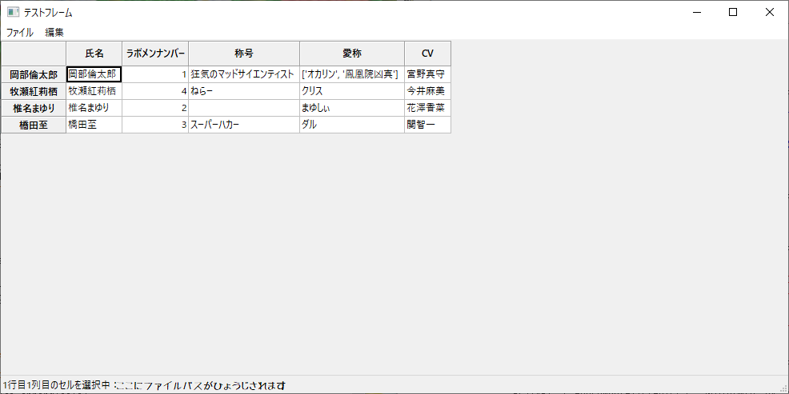

```
[
	{
	'氏名':'岡部倫太郎',
	'ラボメンナンバー':1,
	'称号':'狂気のマッドサイエンティスト',
	'愛称':['オカリン','鳳凰院凶真'],
	'CV':'宮野真守'
	},
	{
	'氏名':'牧瀬紅莉栖',
	'ラボメンナンバー':4,
	'称号':'ねらー',
	'愛称':'クリス',
	'CV':'今井麻美'
	},
	{
	'氏名':'椎名まゆり',
	'ラボメンナンバー':2,
	'愛称':'まゆしぃ',
	'CV':'花澤香菜'
	},
	{
	'氏名':'橋田至',
	'ラボメンナンバー':3,
	'称号':'スーパーハカー',
	'愛称':'ダル',
	'CV':'関智一'
	}
]
```
という`Python`のリスト-辞書型のデータ（`pprint`・`pickle`・`joblib`で保存・ファイル出力されたもの）を読み込んで`wxPython`で表示するスクリプトです．
うｐしてあるもう一つレポジトリ内にある表のGUI部分のスクリプトをほぼほぼ使いまわししたものです．<br>
以上の例はtest.txtの中身で，実際に表示させると以下のように表示されます．

色々機能は簡素ではありますが付けてはいますが，正しく（想像の通りに）動くかわかりません．
現状Undo機能がイマイチ．．．

以上の例でテキストファイル形式で保存すると，
```
[{'CV': '宮野真守',
  'ラボメンナンバー': 1,
  '愛称': ['オカリン', '鳳凰院凶真'],
  '氏名': '岡部倫太郎',
  '称号': '狂気のマッドサイエンティスト'},
 {'CV': '今井麻美', 'ラボメンナンバー': 4, '愛称': 'クリス', '氏名': '牧瀬紅莉栖', '称号': 'ねらー'},
 {'CV': '花澤香菜', 'ラボメンナンバー': 2, '愛称': 'まゆしぃ', '氏名': '椎名まゆり', '称号': ''},
 {'CV': '関智一', 'ラボメンナンバー': 3, '愛称': 'ダル', '氏名': '橋田至', '称号': 'スーパーハカー'}]
 ```
 という中身のテキストファイルが出力されます．
 元のデータとほぼほぼ同じになっていることが確認できます．
